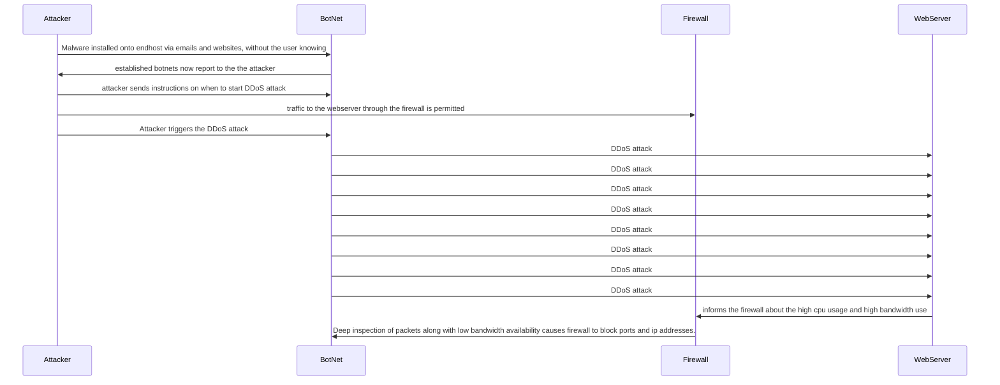

## Documenting The Sequence Diagram

1. Here is the first step to some DDoS attacks. The attacker installs malware to other devices which leds to the attacker being able to control device.

   The malaware is installed onto other devices by sending affected software via emails, websites and usb devices are amoung a few ways.

2. All effected devices are now controlled by the attacker
   
3. the attacker now schedule a time and destination that the DDoS is to take place
   
4. traffic from the attacker/botnets to the firewall is permitted due to the firewall, intially seeing this traffic as regular traffic from a traffic analysis

5. The attack begans, which effects the bandwidth and operabillity of the sever

6. The Firewall now has to decide where the attack is coming from via Traffic analysis once again

7. Once determined where the attack source is, the firewall blocks ports that are apart of the attack.
