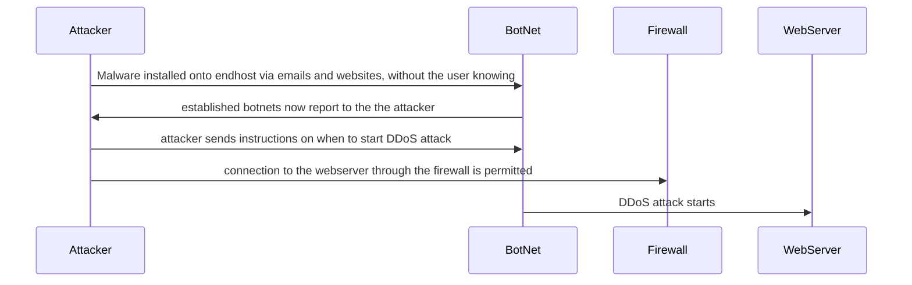

```mermaid
sequenceDiagram
 participant Attacker
 participant BotNet
 participant Firewall
 participant WebServer
 
 Attacker->>BotNet: Malware installed onto endhost via emails and websites, without the user knowing
BotNet->>Attacker: established botnets now report to the the attacker
Attacker->>BotNet: attacker sends instructions on when to start DDoS attack
Attacker->>Firewall: connection to the webserver through the firewall is permitted
BotNet->>WebServer: DDoS attack starts
```
